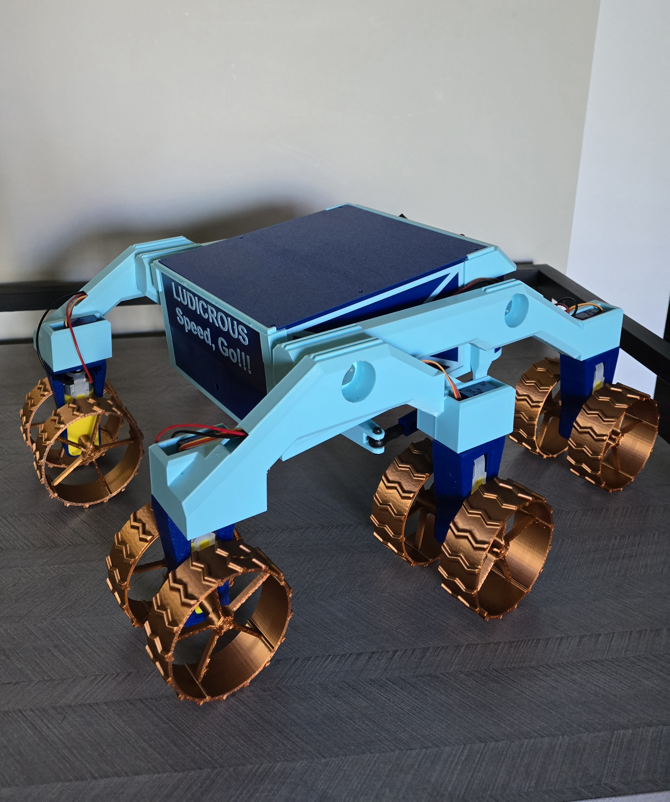

# 🛰️ Mini-Rover

A custom-designed 3D-printed rover that uses a rocker-bogie suspension system and can be remotely controlled over Wi-Fi using an Xbox One controller. The rover is powered by an ESP32 microcontroller running FreeRTOS, and the control system is developed using C and Python.

---

## 🚀 Features

- 🧩 **3D-Printed Chassis**: Custom-designed in PETG for strength and durability.
- 🛞 **Rocker-Bogie Suspension**: Enables smooth traversal over uneven terrain.
- 📶 **Wi-Fi Control**: Xbox One controller is used to control the rover via Wi-Fi.
- 🧠 **ESP32 Microcontroller**: Acts as the brain of the rover.
- ⏱ **Real-Time Performance**: Uses FreeRTOS for multitasking motor control and network communication.
- 💻 **Cross-Language Development**: C for embedded firmware, Python for PC-based controller interface.

---

## 📁 Repository Structure

Mini-Rover/
├── assets/
│   └── images/                     # Photos of the rover (e.g., demo shots, internals)
│       ├── Component-Mounting.jpg
│       ├── Mini-Rover.jpg
│       └── Rover-Guts.jpg
│
├── ESP32-S3/
│   └── Mini-Rover/                # Main PlatformIO project directory
│       ├── include/               # Header files
│       ├── lib/                   # Libraries for I2C, L298N, PCA9685 motor control
│       │   ├── I2C/
│       │   ├── L298N/
│       │   └── PCA9685/
│       ├── python/                # Python scripts to interface with Xbox controller
│       │   ├── controller-read-test.py
│       │   └── controller-to-esp32-wifi.py
│       ├── src/
│       │   └── main.c             # FreeRTOS-based firmware
│       ├── test/                  # Test configurations
│       ├── .vscode/               # VSCode project settings
│       ├── platformio.ini         # PlatformIO configuration file
│       └── sdkconfig.defaults     # ESP-IDF SDK configuration
│
├── README.md                      # Project overview and documentation
└── .gitignore                     # Files to exclude from Git tracking

---

## 📸 Demo



---

## 🛠 Hardware

- ESP32 DevKit-C
- PCA9685 (for servo PWM control)
- 3x L298N Motor Controllers
- 2x LM2596 Buck Converters
- 6x Geared DC Motors
- 6x SG90 Servo Motors
- Power Supply (7.4V Rechargeable Li-Ion Battery)
- 5x 608 ZZ Ball Bearings
- Xbox One Controller (via PC)
- Custom 3D-Printed Chassis and Suspension (PETG)

---

## 🧑‍💻 Software Overview

### Firmware (ESP32)
- Language: **C**
- Framework: **FreeRTOS**
- Responsibilities: Motor control, Wi-Fi communication, command parsing

### Controller Interface (PC)
- Language: **Python**
- Libraries: `pygame`, `socket`, `asyncio`
- Responsibilities: Read Xbox controller input, send commands to ESP32 over Wi-Fi

---

## 📦 Dependencies

**Python Controller Interface**
- Python ≥ 3.8
- `pygame`
- `asyncio`

Install with:
```bash
pip install -r controller/requirements.txt
